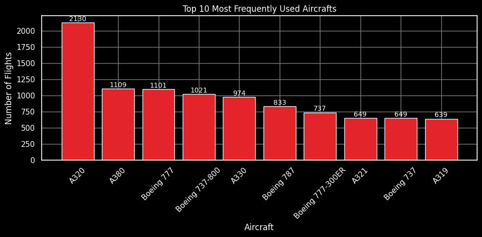
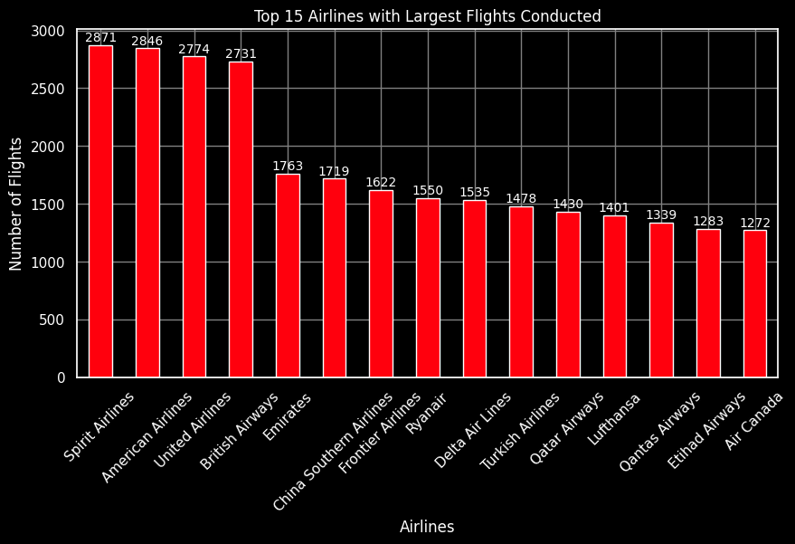
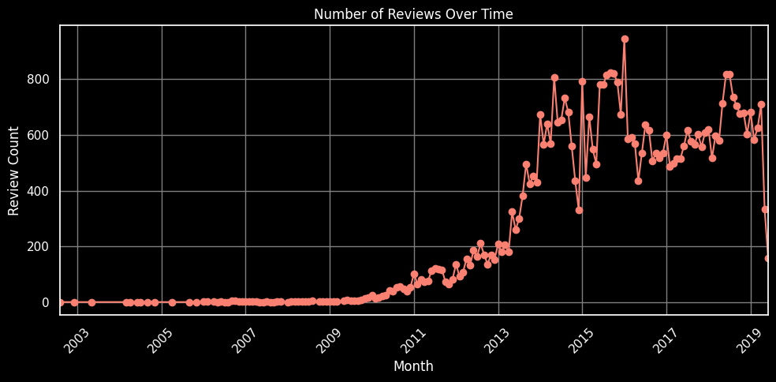
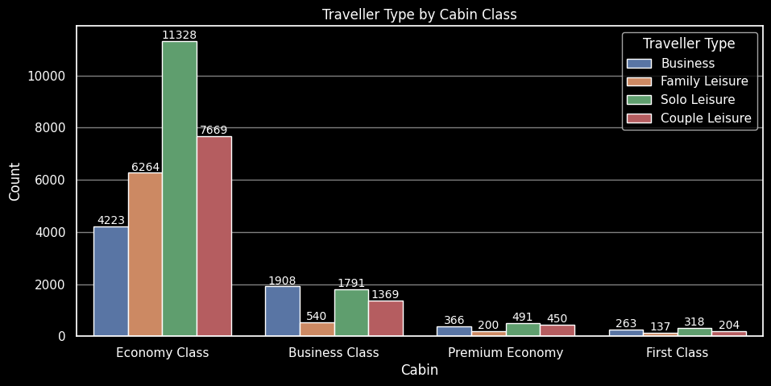
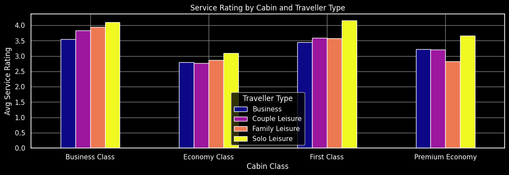
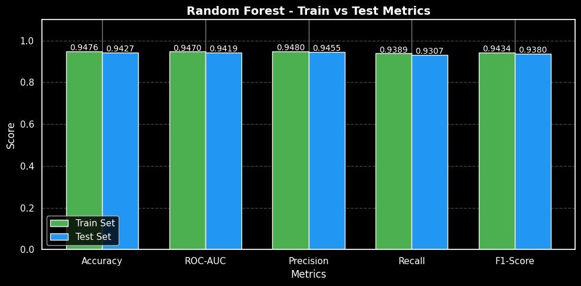

<!-- institute name and logo -->

 AlmaBetter

<!-- Indigo Image Logo -->

    

 

<!-- project and ML title -->
<h1 align='center' style="margin-bottom: 0px;"></h1>

<!-- ML name -->
<h4 align='center' style="margin-top: 0; margin-bottom: 10px;"></h4>

---

<!-- Table of content -->
## Table of Contant

* 
About this Project.

* 
Key Concepts.

* 
Project steps.

* 
What Data set cointains?

* 
Main library to be used.

* 
Insights from Dataset.

* 
Conclusion.

* 
Acknowledgment.

 

---

<!-- About this Project -->
  
## About this Project:

    I am very excited to work on this machine learning project in aviation industry. Airline industry is really interesting. Company like IndiGo not only give flights, but also try to give good travel experience and make strong relation with customer. 
    In this project, I try to understand why passenger refer or recommend the airline. I have customer review data from 2006 to 2019. This data help to know what people think about things like comfort, service, and how they feel overall. 
    With help of data science and machine learning, we will find some patterns and get useful information. This can help airline to make customer experience better and take smart business decisions. So, if you like data, or aviation, or just want to know more — let’s go and learn how to predict what make people say, "Yes, I recommend this airline!"
      

---
  
## Key Concepts:

- **Machine Learning Approach:**
  - Supervised Learning (Classification).
  - Predictive modeling using passenger review data.

- **Data Insights:**
  - Feature engineering based on travel experience factors.
  - Data visualization to explore customer behavior and satisfaction.

- **Model Evaluation:**
  - Use of evaluation metrics like accuracy, precision, recall, and F1-score.
  - Comparison of multiple classification models to find the best performer.

## Project Steps:

1. **Data Preparation:**
   - Collected and cleaned passenger review data.
   - Handled missing values and prepared features for modeling.

2. **Exploratory Data Analysis (EDA):**
   - Visualized customer review patterns and key travel factors.
   - Identified trends related to referrals.

3. **Model Development:**
   - Built classification models to predict if a passenger will recommend the airline.
   - Tuned model hyperparameters for better performance.

4. **Evaluation and Deployment:**
   - Tested models on new data to check accuracy.
   - Shared insights to help improve customer satisfaction and referral rates.
  
---
  
<!-- What Data set Containes -->
<!-- columns and their descriptions -->

    

    What Data Set Contains?

 

1. airline: Name of the airline company.  
2. overall: Total score given to the trip (between 1 and 10).  
3. author: Name of the person who gave the review.  
4. review_date: Date when the review was written.  
5. customer_review: Text of the review about the flight.  
6. aircraft: Type or model of airplane used.  
7. traveller_type: Type of traveler (like business trip or leisure trip).  
8. cabin: Which class — like Economy, Business, or First.  
9. route: The flight route (from where to where).  
10. date_flown: Date of the actual flight.  
11. seat_comfort: How comfortable the seat was (rated 1 to 5).  
12. cabin_service: Service in the cabin (rated 1 to 5).  
13. food_bev: Food and drink quality (rated 1 to 5).  
14. entertainment: In-flight entertainment rating (1 to 5).  
15. ground_service: Service on the ground (check-in, boarding etc.) (rated 1 to 5).  
16. value_for_money: Is the flight worth the price? (rated 1 to 5).  
17. recommended: Did the person recommend the airline? (yes or no) — This is the target column.  

  

---
  
<!-- Library used in projects and their description -->

 
 Main Libraries Used 
   

🔢 NumPy – For efficient numerical operations and array handling. 
📊 Pandas – To load, clean, and manipulate structured datasets. 
📈 Matplotlib & Seaborn – For visualizing trends, distributions, and feature relationships with the target variable. 
🧪 SciPy – Useful for performing statistical tests (e.g., chi-squared test for feature relationships). 
🧠 scikit-learn (sklearn) – Core machine learning library for:

<ul> <li>Data preprocessing (LabelEncoder, StandardScaler, MinMaxScaler)</li> <li>Model training (Logistic Regression, Decision Tree, Random Forest, etc.)</li> <li>Model evaluation (accuracy, precision, recall, F1-score, ROC-AUC, etc.)</li> <li>Hyperparameter tuning (GridSearchCV, RandomizedSearchCV)</li> </ul>
⏱️ Time – To track the runtime of model training and evaluation. 
🚫 Warnings – Suppresses warning messages to keep the output clean during development. 

 

  

---
  

 Insights... 

    
    
    
    
    
    

---
  
## Conclusion:

In this project, we systematically cleaned and prepared the data, ensuring quality for analysis. Key features were selected to focus on the most relevant information, improving model performance. Multiple machine learning models were tested, including Logistic Regression, Decision Tree, and Random Forest. Cross-validation and hyperparameter tuning helped optimize results and prevent overfitting. The Random Forest model outperformed others, achieving an impressive 94.27% accuracy and 93.80% F1-score. The Decision Tree model, however, showed signs of overfitting. Overall, the best models demonstrated balanced and consistent metrics. These insights can help airlines enhance customer experience and increase referral rates.

  

---
  
### Acknowledgments:

This project is dedicated to leveraging machine learning to improve customer experience in the aviation industry. Special thanks to AlmaBetter for providing the learning platform, guidance, and resources that made this project possible. Gratitude is also extended to the open-source community for the powerful tools and libraries that supported this work.

 Created with 🧠 by <a href="https://github.com/KushangShah">Kushang Shah</a>

  
